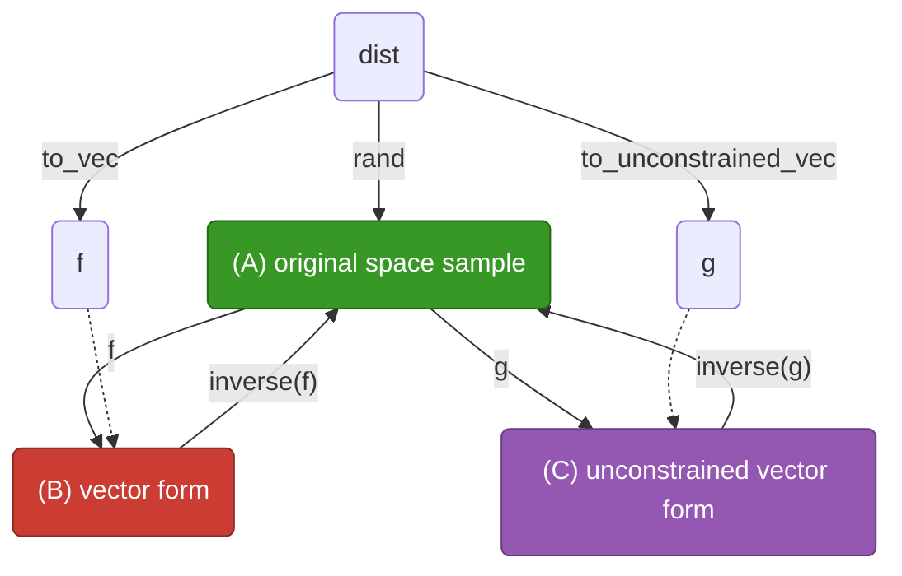

# Plaice.jl

[](https://juliabayes.org/Plaice.jl/)

Plaice.jl converts samples from distributions to and from vectors.



It assumes that there are three forms of samples from a distribution `dist` that we are interested in:

 1. **(A) the sample in original space**, which is what `rand(d)` returns.

 2. **(B) a vectorised form**, which is a vector that contains a flattened version of the original form.

 3. **(C) an unconstrained vectorised form**, which is a vector in which:

      + each element is independent; and
      + each element is unconstrained (can take any value in ℝ).

and provides functionality to convert between these three forms, illustrated in the diagram above.

Much of this code is lifted from Bijectors.jl.
However, on top of defining a clearer interface than Bijectors, Plaice also has the aim of being:

 1. Usable on GPUs, particularly via Reactant.jl.

 2. More performant and compatible with modern automatic differentiation.

Much of this is in fact contingent on the underlying distributions.
To this end, Plaice is also intentionally decoupled from Distributions.jl: the pre-existing functionality for Distributions.jl is provided in an extension.
This allows other distribution providers to use the functionality in this library as well.

## Quick example

```julia
julia> using Plaice, Distributions

julia> dist = product_distribution((a=Normal(), b=Dirichlet(ones(3))))
ProductNamedTupleDistribution{(:a, :b)}(
a: Normal{Float64}(μ=0.0, σ=1.0)
b: Dirichlet{Float64, Vector{Float64}, Float64}(alpha=[1.0, 1.0, 1.0])
)

julia> A = rand(dist)
(a = -1.6804996240649275, b = [0.2758787234375264, 0.6614907087916384, 0.06263056777083534])

julia> f = to_vec(dist);
       B = f(A)
4-element Vector{Float64}:
 -1.6804996240649275
  0.2758787234375264
  0.6614907087916384
  0.06263056777083534

julia> g = to_unconstrained_vec(dist);
       C = g(A)
3-element Vector{Float64}:
 -1.6804996240649275
 -0.2718503455476954
  2.3572424758165047
```

Notice that the unconstrained vector `C` has one fewer element than the vectorised form `B`, because the Dirichlet distribution is constrained to the simplex (i.e. its elements must sum to 1), and thus one of its elements is redundant.

## Why Plaice?

A plaice is a flatfish, and Plaice's role is to flatten samples.

It's also a deeper, low-level dependency for probabilistic programming, and is very much out of the limelight, much like how plaice live on the sea floor.
